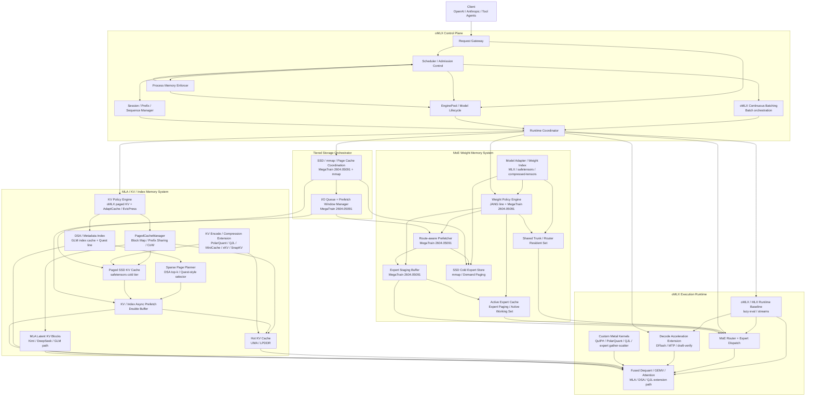
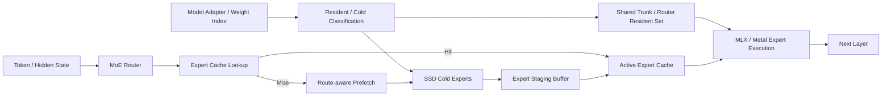
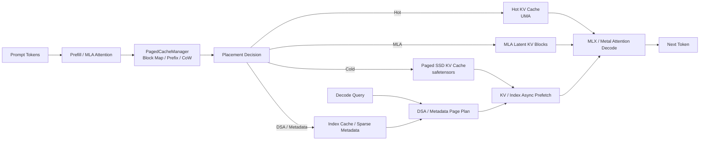

# oMLX Memory-First MoE Serving 系統架構模組圖

## 1. 目標定位

這份新版架構的核心，不再只是「長 context 的 KV 壓縮系統」，而是：

> **在 Apple Silicon 的固定 UMA 預算下，以模型規模優先，聯合優化 MoE 權重與 KV cache，讓超大模型、實用級長 context 與後續多租戶 serving 同時變得可行。**

目前的設計立場如下：

- 平台：Apple Silicon / UMA / Metal / SSD
- serving 骨架：承接 `oMLX` 既有的 OpenAI / Anthropic API、EnginePool、continuous batching、paged SSD KV cache
- 執行路徑：以 `oMLX runtime over MLX` 為 baseline，再針對熱點下探 `Metal`
- 熱點路徑：由 `oMLX` extension 層實作 expert paging、MLA/DSA-aware KV 與必要的 custom Metal kernels
- 第一優先：**模型規模**
- 第二優先：**實用級長 context**
- 第三優先：**多用戶 serving / 吞吐**
- 目標模型：**large / ultra-large sparse MoE**，如 `Kimi K2.6`、`GLM 5.1`、`DeepSeek-V3` 類型

這代表系統主線必須從「只做 KV lifecycle」升級為三條並列主線：

1. **oMLX Serving / Model Lifecycle Baseline**
2. **MoE Weight Memory System**
3. **MLA / KV / Index Memory System**

---

## 2. 核心設計原則

### 2.1 Model Scale First

系統的首要任務，是讓更大的 sparse MoE 模型在單機 Apple Silicon 上變得可用，而不是先追小模型 benchmark。

### 2.2 Memory-first，而不是 Framework-first

架構不是為了綁定單一 runtime 而設計，而是為了控制：

- 權重工作集
- active experts
- KV working set
- SSD <-> GPU-visible UMA 的資料流與 CPU/GPU stream 分工

### 2.3 用算力換空間

可接受額外的：

- 量化 / 解量化
- fused kernel
- route-aware prefetch
- metadata scan
- staging / double buffer

來交換：

- 更大的模型參數量
- 更長的 context
- 更低的記憶體搬運壓力

### 2.4 權重與 KV 聯合優化

如果只優化權重，不優化 KV，context 會失敗。  
如果只優化 KV，不優化權重，超大 MoE 模型放不下。  
因此新版架構必須把兩者視為同一個總體記憶體問題。

### 2.5 先承接 oMLX baseline，再做 research extension

目前公開的 `oMLX` 已經具備幾個與本專案高度重疊的 baseline：

- OpenAI / Anthropic-compatible API
- `EnginePool` / multi-model lifecycle
- oMLX continuous batching abstraction（底層可參考 / 包裝 `mlx-lm BatchGenerator`）
- block-based paged KV、prefix sharing、Copy-on-Write
- RAM hot tier + SSD cold tier 的 persistent KV cache
- process-level memory limit、model LRU / TTL / pinning

因此調整後的規劃不應把這些能力當成從零自研，而應把它們視為 **oMLX substrate**。

本專案真正需要新增或大幅擴充的是：

- ultra-large MoE 的 expert weight paging
- route-aware expert cache / staging / prefetch
- MLA-native KV block lifecycle
- GLM 類 DSA index cache / sparse page map
- KV compression / sparse retrieval 與 SSD KV 的進階 policy
- profiling 後才落地的 custom Metal kernels
- DFlash / MTP-style decode acceleration extension

### 2.6 MLX 特性對架構的約束

`oMLX` 的底座是 `MLX`，所以規劃要符合幾個平台特性：

- **Unified memory**：CPU / GPU 共享同一個 UMA pool，不能用傳統「CPU RAM vs GPU VRAM」的思維分帳；所有權重、KV、metadata、staging、runtime buffer 都會互相擠壓。
- **Lazy evaluation**：prefetch、benchmark、memory accounting 必須定義明確的 `eval` / synchronize 邊界，否則量測與資源釋放會失真。
- **Streams / multi-device**：小型 metadata scan、I/O orchestration、routing 統計可放 CPU；高密度 GEMV/GEMM/attention 放 GPU；中間不應假設有昂貴 device copy。
- **MLX-format models first**：第一版落地應先吃 MLX / safetensors / compressed-tensors 的實際檔案 layout，再往抽象權重分頁策略推進。

---

## 3. 256GB Mac 的工作集假設

這份架構以 `256GB UMA` 的機器為例，保守抓 **約 192GB** 作為可調度的有效工作集。

調整後不再使用單一固定分帳，因為 `oMLX` baseline、Kimi-style MLA MoE、GLM-style MLA+DSA MoE 的壓力完全不同。

新的原則是 **profile-based budgeting**：由模型 adapter / scheduler 根據模型架構選擇預算 profile。

### 3.1 oMLX baseline serving profile

適用於一般 MLX-format dense / medium MoE / coding-agent backend，主線是現有 oMLX 的 persistent SSD KV cache 與 multi-model serving。

| 區塊 | 建議範圍 | 角色 |
| --- | --- | --- |
| Loaded Model Set | 依 `max-model-memory` / `max-process-memory` | EnginePool 內已載入的 LLM / VLM / embedding / reranker |
| Hot KV Cache | 10% - 30% UMA 或依模型設定 | oMLX hot tier，保存高命中 KV blocks |
| SSD KV Cold Tier | SSD 空間主導 | safetensors KV blocks，支援跨請求 / 跨重啟 prefix reuse |
| Cache Metadata / Block Map | 1GB - 8GB | prefix sharing、Copy-on-Write、LRU、page table |
| Runtime Headroom | 16GB - 32GB | MLX lazy graph、temporary arrays、scheduler、OS page cache |

### 3.2 Kimi / DeepSeek-style MLA MoE profile

適用於 `Kimi K2.6` / `DeepSeek-V3` 類型。這類模型的單 session MLA KV 不一定是最大瓶頸，第一瓶頸通常是 expert weight lifecycle。

| 區塊 | 256GB PoC 建議 | 角色 |
| --- | --- | --- |
| Resident Trunk / Router / Shared Path | 30GB - 50GB | dense layer、router、shared expert、embedding、always-hot weights |
| Active Expert Cache | 50GB - 80GB | 保存高命中 `(layer_id, expert_id)` 權重 |
| Expert Staging / Prefetch Buffer | 24GB - 32GB | SSD -> GPU-visible UMA 的雙緩衝與 next-layer prefetch |
| MLA KV Hot / Warm Working Set | 20GB - 60GB | MLA latent KV、prefix sharing、低併發長 context |
| Runtime / MLX / Metal Headroom | 16GB - 24GB | MLX temporary arrays、Metal buffers、scheduler |
| Safety / OS Page Cache | 12GB - 24GB | 避免 memory pressure 觸發不可控 swap |

### 3.3 GLM-style MLA + DSA MoE profile

適用於 `GLM 5.1` 類 `glm_moe_dsa` 模型。這類模型除了 expert paging，還需要 DSA index / sparse selector / page map 的預算。

| 區塊 | 256GB PoC 建議 | 角色 |
| --- | --- | --- |
| Resident Trunk / Router / Dense / Shared Path | 35GB - 70GB | 前段 dense layer、router、shared expert、DSA/MLA 常駐路徑 |
| Active Expert Cache | 60GB - 90GB | GLM active params 較重，需更高 expert hit rate |
| Expert Staging / Prefetch Buffer | 24GB - 32GB | SSD expert I/O 遮蔽 |
| MLA KV Hot / Warm Working Set | 16GB - 40GB | latent KV blocks |
| DSA Index / Sparse Metadata | 8GB - 32GB | index cache、top-k selected page map、sparse gather metadata |
| Runtime / MLX / Metal Headroom | 16GB - 24GB | lazy eval、temporary arrays、kernel workspace |
| Safety / OS Page Cache | 12GB - 24GB | SSD tier 需要留 page cache 與突發峰值 |

這個分帳的含義是：

- 對一般 oMLX serving，先把 **paged SSD KV cache** 與 multi-model lifecycle 做穩。
- 對 MLA MoE，先把 **expert cache / prefetch** 做穩，再補 KV compression。
- 對 MLA+DSA MoE，`KV` 與 `index cache` 要合併設計，避免 Quest-style metadata 和 DSA metadata 重複吃 UMA。
- `SSD` 不是被動 swap，而是 **cold KV / cold expert / cold index block 的主動分層**。

---

## 4. 總體模組圖

---

## 5. 分層說明

### 5.1 oMLX Control Plane

這一層直接承接 `oMLX` 現有的 server / engine / cache 骨架。調整後的定位不是重寫 serving framework，而是把現有 oMLX 控制平面擴充成 memory-aware / expert-aware / index-aware scheduler。

- **Request Gateway**
  - 接收 OpenAI-compatible 與 Anthropic-compatible API 請求
  - 做請求封裝、路由、認證、模型 alias 與 tool-calling 格式處理
- **EnginePool / Model Lifecycle**
  - 管理 LLM、VLM、embedding、reranker 等多種 engine
  - 支援 model LRU、TTL、pinning、manual load / unload
  - 以 `max-model-memory` / `max-process-memory` 控制 process 級記憶體壓力
- **Scheduler / Admission Control**
  - 控制請求進場順序
  - baseline 可沿用 oMLX 的 FCFS / concurrency 設定
  - 延伸版需同時平衡 prefill、decode、KV cache、expert cache、DSA index 與 SSD queue 壓力
- **oMLX Continuous Batching**
  - `continuous batching` 是 oMLX 已具備的 baseline，不應放到最後才做
  - `mlx-lm BatchGenerator` 可作底層實作參考或相容 adapter，但 control plane 對外應暴露 oMLX 自己的 batching abstraction
  - 後續優化重點是把 batching 和 expert route locality / KV block locality 接起來
- **Session / Sequence Manager**
  - 維護 sequence、prefix sharing、Copy-on-Write、KV block/page 與活躍專家狀態
- **Process Memory Enforcer**
  - 將 MLX lazy arrays、loaded models、hot KV、metadata、staging buffer 納入同一個 UMA 預算
  - 在進場前拒絕或延後會造成 memory pressure 的請求
- **Runtime Coordinator**
  - 統一協調權重系統、KV/index 系統、MLX/Metal runtime 與 storage orchestrator

**參考來源**

- oMLX 現有 README / 官方網站已明確列出 OpenAI + Anthropic API、EnginePool、多模型 lifecycle、continuous batching、paged SSD KV cache 與 process memory enforcement。
- 長筆記中對應的重點是 block/page 級記憶體管理、動態 batching 與 memory-aware scheduling；調整後要把這些能力映射到 oMLX 現有模組，而不是另起一套控制平面。

### 5.2 MoE Weight Memory System

這是 oMLX baseline 之外最重要的 extension。現有 oMLX 可以載入 MLX-format 模型並做 multi-model LRU，但 `Kimi K2.6` / `GLM 5.1` 這種數百 GB 到 TB 級 MoE，不能假設完整 resident，必須新增 expert weight lifecycle。

- **Model Adapter / Weight Index**
  - 解析 MLX / safetensors / compressed-tensors 檔案 layout
  - 建立 `(layer_id, expert_id, tensor_name, file_path, byte_offset, quant_metadata)` index
  - 將 resident trunk、router、shared expert、cold routed expert 明確分類
- **Weight Policy Engine**
  - 控制 bit allocation、hot/cold placement、layer/expert residency
- **Shared Trunk / Router Resident Set**
  - 常駐共享權重、router、embedding、always-hot 路徑
- **Active Expert Cache**
  - 保存目前最常命中的 experts
  - 是模型規模與 decode 穩定度的核心工作集
- **Expert Staging Buffer**
  - 專門處理 SSD -> GPU-visible UMA staging 的中繼搬運
  - 用來實作雙緩衝與預取遮蔽
- **Route-aware Prefetcher**
  - 根據 router 結果、下一層專家預測、歷史命中率，預先搬運 cold experts
- **SSD Cold Expert Store**
  - 保存非活躍 experts
  - 是支撐 1.1T class MoE 的核心擴充層

**參考來源**

- `Kimi K2.6-oMLX-本地運行可行性.md` 與 `GLM-5.1-oMLX-本地運行可行性.md`
  - 都指出第一階段應先建立 loader / weight index / single expert path，而不是直接追長 context 或多用戶。
- **MegaTrain: A Memory-Centric System for Foundation Model Training** (`arXiv:2604.05091`)
  - 對應這一層的 `Expert Staging Buffer`、`Route-aware Prefetcher`、雙緩衝管線、動態層綁定、結構化 MoE 分組。
- **Weight Paging / On-demand Weight Loading / mmap**
  - 在長筆記中被明確整理成工程策略：
  - `mmap` / demand paging
  - `Layer-wise Paging`
  - `Expert Paging (MoE)`
  - `QJL-Backed Paging`
- **PolarQuant + QJL**
  - 雖然主要在 KV 路徑中使用，但長筆記也明確提到可把同一套壓縮邏輯延伸到權重分頁與 SSD 權重搬運，作為 `Expert Paging` 的壓縮基礎。

### 5.3 MLA / KV / Index Memory System

這一層要先對齊 oMLX 既有的 two-tier KV cache，再往 MLA / DSA / compression extension 擴充。調整後的重點是：`paged SSD KV` 是 baseline；`PolarQuant / QJL / Quest / SnapKV` 是後續 policy / kernel extension。

- **KV Policy Engine**
  - 控制 KV 的 placement、eviction、retrieval 與壓縮策略
  - baseline 先遵守 oMLX hot RAM / cold SSD 的 block lifecycle
- **PagedCacheManager / Block Map**
  - 管理 block-based KV、prefix sharing、Copy-on-Write
  - 是 continuous batching 與跨請求 cache reuse 的核心資料結構
- **Hot KV Cache**
  - 當前 decode 最常用的 KV pages
- **Paged SSD KV Cache**
  - 保存 cold KV blocks
  - 使用可恢復的磁碟表示，支援跨請求與 server restart 後的 prefix reuse
- **MLA Latent KV Blocks**
  - 對 Kimi / DeepSeek / GLM 類模型，KV 要以 MLA latent representation 估算與分頁
  - 這會讓單 session 長 context 的 KV 壓力低於 full KV，但多 session 仍需要 policy
- **DSA / Metadata Index**
  - 對 GLM 類模型，DSA index cache / sparse selector 會和 KV metadata 競爭 UMA
  - Quest-style metadata 不應和 DSA indexer 分裂成兩套互不相干的索引
- **Sparse Page Planner**
  - 將 DSA top-k / Quest-style selector 的結果映射到 paged KV / SSD KV blocks
- **KV / Index Async Double Buffer Prefetch**
  - 從 SSD 非同步拉回 KV block 或 index block
  - 與 GPU 計算重疊，隱藏 I/O 延遲
- **KV Encode / Compression Extension**
  - PolarQuant / QJL / MiniCache / xKV / SnapKV 放在此層
  - 對 MLA MoE，這些技術不應早於 MLA paged KV correctness

**參考來源**

- **oMLX Paged SSD KV Cache**
  - 對應 hot RAM / cold SSD、block-based KV、prefix sharing、Copy-on-Write、safetensors cold tier。
- **SnapKV** (`arXiv:2404.14469`)
  - 對應 prefill 階段的低價值 token 過濾，屬於 `KV Policy Engine` 的上游減量邏輯。
- **MiniCache** (`arXiv:2405.14366`)
  - 對應 `Layer-wise KV Compression` 的相鄰層融合思路。
- **xKV** (`arXiv:2503.18893`)
  - 對應 `Layer-wise KV Compression` 的跨層 SVD / 低秩共享思路。
- **AdaptCache** (`arXiv:2509.00105`)
  - 對應 KV 的 utility-aware 壓縮與 hot/warm/cold 分層。
- **EvicPress** (`arXiv:2512.14946`)
  - 對應 KV 的 placement / eviction / SSD cold tier。
- **Quest** (`arXiv:2406.10774`)
  - 對應 `Metadata Index` 與 `Quest-style Page Selector`。
- **MegaTrain** (`arXiv:2604.05091`)
  - 對應 `KV Async Double Buffer Prefetch` 的雙緩衝預取思路。

### 5.4 oMLX Execution Runtime

這一層的主語應該是 `oMLX runtime`，不是 `mlx-lm`。更精準地說，oMLX 在 MLX primitives、lazy evaluation、streams 與 model/cache lifecycle 上建立自己的 serving runtime；`mlx-lm` 只能作為部分模型路徑的 bring-up / correctness baseline，而不應定義整個執行層的邊界。

- **oMLX / MLX Runtime Baseline**
  - 第一版優先使用 oMLX 已封裝的 MLX-format model loading、cache lifecycle、batching path 與 MLX ops
  - 若某個模型路徑可直接對照 `mlx-lm`，可用它做 correctness / performance baseline，但不把它當成架構核心
  - 明確控制 lazy eval / synchronize 邊界，避免 memory accounting 與 benchmark 失真
- **MoE Router + Expert Dispatch**
  - 把 hidden states 導向正確 experts
  - 對接 active expert cache 與 staging buffer
- **Fused Dequant / GEMV / Attention**
  - 將權重 dequant、MLA / DSA / KV decode、attention 盡量融合
  - 用算力換頻寬，避免中間張量回寫
- **Decode Acceleration Extension**
  - `DFlash` / MTP-style speculative decoding 放在這一層，作為 decode-heavy 場景的後期加速插件
  - 它主要降低 target model 的平均 decode forward 次數，不直接解決權重容量、KV 容量或 SSD 分層問題
  - 接入時需把 draft model 權重、draft / target KV 狀態、rollback buffer、prefix snapshot 與 acceptance metrics 納入 ProcessMemoryEnforcer 和 scheduler
  - 社群 `dflash-mlx` 已證明 DFlash 可以在 stock MLX + 少量 targeted Metal kernels 上運作，但這不等於官方 `mlx-lm` baseline 已內建 DFlash
- **Custom Metal Kernels**
  - 包含 `FWHT / Hadamard`
  - `PolarQuant + QJL encode/decode`
  - `expert gather/scatter`
  - 其他高頻 data movement / compute 熱點
  - 只在 MLX baseline 確認瓶頸後進入主線，避免 premature kernel work

**參考來源**

- **MLX runtime**
  - 對應 unified memory、lazy evaluation、streams、多 device operation 與 custom Metal extension 能力。
- **QuIP#** (`arXiv:2402.04396`)
  - 對應 randomized Hadamard transform / incoherence，在 `FWHT / Hadamard` 這條線上最接近目前要寫的 Metal kernel 參考。
- **PolarQuant** (`arXiv:2502.02617`)
  - 對應 KV cache polar transformation + random preconditioning。
- **PolarQuant** (`arXiv:2502.00527`)
  - 對應 RoPE 成對維度轉 polar coordinates 與 decode acceleration。
- **QJL** (`arXiv:2406.03482`)
  - 對應低 bit KV 表示、QJL encode/decode 與壓縮態存放。
- **DFlash** (`arXiv:2602.06036`)
  - 對應 block diffusion draft + target verification 的 speculative decode path，適合作為 decode accelerator extension。
- **dflash-mlx**
  - 對應 Apple Silicon / MLX 上的社群 DFlash 實作證據，可作 PoC 參考；現階段不應視為官方 `mlx-lm` 內建能力。
- **FlashAttention-style fusion**
  - 長筆記裡明確提到把 `QJL 解壓` 與 attention 融合在同一條 Metal path 中；這裡先視為工程融合方向，之後可再細化到特定 attention kernel 論文。

### 5.5 Tiered Storage Orchestrator

這一層不是單純讓作業系統自動 swap，而是主動管理分層存放。

- **SSD / mmap / Page Cache Coordination**
  - 控制 cold KV、cold expert 與 cold index block 的檔案映射方式
  - KV cold tier 優先沿用 oMLX 的 paged SSD cache；expert / index tier 是新增 extension
- **I/O Queue + Prefetch Window Manager**
  - 管理預取節奏
  - 避免 expert、KV 與 DSA/index block 同時爭搶 I/O
  - 為 decode 建立穩定的資料到達窗口

**參考來源**

- **MegaTrain** (`arXiv:2604.05091`)
  - 對應 memory-centric system、主動預取、雙緩衝與 overlap execution。
- **AdaptCache** (`arXiv:2509.00105`)
  - 對應多層級 cache hierarchy 與 utility-aware placement。
- **EvicPress** (`arXiv:2512.14946`)
  - 對應 SSD / LPDDR 之間的 eviction / placement 決策。
- **Quest** (`arXiv:2406.10774`)
  - 對應 page 級 metadata 導引的 sparse 回讀。
- **mmap / demand paging**
  - 對應 Apple Silicon 上的 file-backed mapping 與 page cache 配合。

---

## 6. 關鍵資料流

### 6.1 MoE 權重生命週期

這條路徑反映的核心思想是：

- `MoE` 的可行性，來自於「不是每個 token 都要讀全部參數」
- `oMLX` baseline 沒有替超大 MoE 自動解決 expert weight paging
- 因此必須先建立 **model adapter / weight index**，再把 **expert residency** 與 **route-aware prefetch** 視為第一級核心模組

### 6.2 KV / Index 生命週期

這條路徑反映的核心思想是：

- oMLX 的 `paged SSD KV cache` 已經是 baseline，後續規劃要把它接到 MLA / DSA / compression policy
- context 不是越大越好，而是要在 **可接受的 decode 頻寬成本** 下變大
- 因此 `prefix reuse + metadata / DSA sparse retrieval + prefetch` 是長 context 成立的必要條件

---

## 7. 模組責任與參考來源對照表

| 模組 | 主要責任 | oMLX 符合度 / 優先級 | 主要參考來源 |
| --- | --- | --- | --- |
| Request Gateway | API 接入、OpenAI / Anthropic 兼容、tool calling | 已符合 / 高 | `oMLX` API compatibility |
| EnginePool / Model Lifecycle | 多模型載入、LRU、TTL、pinning、manual load/unload | 已符合 / 高 | `oMLX` EnginePool / model management |
| Process Memory Enforcer | 控制 process-level UMA 上限 | 已符合，需擴到 expert/KV/index / 最高 | `oMLX` max-process-memory；MLX unified memory |
| Scheduler / Admission Control | 調度 prefill / decode / prefetch / I/O | 部分符合，需 expert-aware / 最高 | `oMLX` scheduler + continuous batching；本專案 extension |
| oMLX Continuous Batching | continuous batching、batch admission、decode step orchestration | 已符合，需 expert/KV/index-aware 擴充 / 高 | `oMLX` batching abstraction；`mlx-lm BatchGenerator` 作底層參考 |
| PagedCacheManager | block map、prefix sharing、Copy-on-Write | 已符合 / 高 | `oMLX` paged KV |
| Paged SSD KV Cache | hot RAM / cold SSD KV block 分層 | 已符合 / 最高 | `oMLX` SSD KV cache |
| Runtime Coordinator | 協調權重、KV/index、MLX/Metal、storage | 需新增整合 / 高 | `oMLX` extension；memory-first serving stack |
| Model Adapter / Weight Index | 解析 MLX / safetensors / compressed-tensors，定位 expert shards | 缺口 / 最高 | Kimi / GLM feasibility notes |
| Weight Policy Engine | 控制權重 hot/cold、bit allocation | 缺口 / 最高 | `JANG` mixed precision line；MegaTrain (`arXiv:2604.05091`) |
| Shared Trunk / Router Resident Set | 常駐共享權重與 router | 缺口 / 最高 | MoE working set 策略；MegaTrain (`arXiv:2604.05091`) |
| Active Expert Cache | 維持 MoE 活躍工作集 | 缺口 / 最高 | Expert Paging / Active Working Set；MegaTrain (`arXiv:2604.05091`) |
| Expert Staging Buffer | SSD -> GPU-visible UMA 中繼與雙緩衝 | 缺口 / 最高 | MegaTrain (`arXiv:2604.05091`) |
| Route-aware Prefetcher | 依 router 預取 experts | 缺口 / 最高 | MegaTrain (`arXiv:2604.05091`)；MoE routing-aware prefetch engineering line |
| SSD Cold Expert Store | 支撐數百 GB 到 TB 級 MoE | 缺口 / 最高 | `mmap` / demand paging；Weight Paging / Expert Paging 工程策略 |
| MLA Latent KV Blocks | Kimi / DeepSeek / GLM 類 latent KV 分頁 | 缺口 / 高 | Kimi / GLM feasibility notes |
| DSA / Metadata Index | GLM DSA index cache、sparse page map、Quest metadata | 缺口 / 高 | GLM feasibility note；Quest (`arXiv:2406.10774`) |
| KV Policy Engine | 控制 KV 壓縮、減量、placement | baseline 已有，進階缺口 / 高 | oMLX SSD KV；SnapKV / AdaptCache / EvicPress |
| KV Encode / Compression | 壓縮 KV 以利 LPDDR / SSD 存放 | 後續 extension / 中高 | PolarQuant (`arXiv:2502.02617`, `arXiv:2502.00527`)；QJL (`arXiv:2406.03482`)；QuIP# (`arXiv:2402.04396`) |
| Layer-wise KV Compression | 壓縮 depth 維度冗餘 | 後續 extension / 中 | MiniCache (`arXiv:2405.14366`)；xKV (`arXiv:2503.18893`)；Cross-layer Fusion line |
| KV / Index Async Prefetch | 遮蔽 cold KV / index I/O 延遲 | baseline 有 KV，index/expert 需擴充 / 高 | oMLX SSD KV；MegaTrain (`arXiv:2604.05091`) |
| oMLX Execution Runtime | oMLX/MLX baseline、熱路徑下探 Metal | 部分符合 / 高 | oMLX runtime；MLX docs；QuIP# / PolarQuant / QJL |
| Decode Acceleration Extension | DFlash / MTP-style draft-verify、acceptance tracking、rollback / prefix snapshot | 後期 extension / 中 | DFlash (`arXiv:2602.06036`)；`dflash-mlx` 社群 MLX 實作；MTP 對照 |
| Tiered Storage Orchestrator | 管理 SSD / UMA / page cache / I/O queue | 需擴到 expert + index / 最高 | oMLX SSD KV；MegaTrain；AdaptCache；EvicPress；Quest |

---

## 8. 主要來源索引

### 8.1 oMLX / MLX 基線來源

| 來源 | 對本文件的意義 |
| --- | --- |
| [oMLX official site](https://omlx.ai/) | 確認 oMLX 的核心 baseline：paged SSD KV cache、continuous batching、multi-model serving、OpenAI / Anthropic API、tool calling。 |
| [jundot/omlx README](https://github.com/jundot/omlx) | 對應 EnginePool、ProcessMemoryEnforcer、PagedCacheManager、PagedSSDCacheManager、CLI memory settings 與模型 lifecycle。 |
| [MLX documentation](https://ml-explore.github.io/mlx/build/html/index.html) | 對應 unified memory、lazy computation、multi-device、custom Metal extension 等 MLX 底層特性。 |

### 8.2 主要論文索引

| 技術 | 論文 | 編號 |
| --- | --- | --- |
| SnapKV | *SnapKV: LLM Knows What You are Looking for Before Generation* | `arXiv:2404.14469` |
| Quest | *Quest: Query-Aware Sparsity for Efficient Long-Context LLM Inference* | `arXiv:2406.10774` |
| MiniCache | *MiniCache: KV Cache Compression in Depth Dimension for Large Language Models* | `arXiv:2405.14366` |
| xKV | *xKV: Cross-Layer SVD for KV-Cache Compression* | `arXiv:2503.18893` |
| AdaptCache | *AdaptCache: KV Cache Native Storage Hierarchy for Low-Delay and High-Quality Language Model Serving* | `arXiv:2509.00105` |
| EvicPress | *EvicPress: Joint KV-Cache Compression and Eviction for Efficient LLM Serving* | `arXiv:2512.14946` |
| MegaTrain | *MegaTrain: A Memory-Centric System for Foundation Model Training* | `arXiv:2604.05091` |
| QJL | *QJL: 1-Bit Quantized JL Transform for KV Cache Quantization with Zero Overhead* | `arXiv:2406.03482` |
| PolarQuant (KV / random preconditioning line) | *PolarQuant: Quantizing KV Caches with Polar Transformation* | `arXiv:2502.02617` |
| PolarQuant (RoPE / decode acceleration line) | *PolarQuant: Leveraging Polar Transformation for Efficient Key Cache Quantization and Decoding Acceleration* | `arXiv:2502.00527` |
| QuIP# | *QuIP#: Even Better LLM Quantization with Hadamard Incoherence and Lattice Codebooks* | `arXiv:2402.04396` |
| DFlash | *DFlash: Block Diffusion for Flash Speculative Decoding* | `arXiv:2602.06036` |

補充說明：

- `mmap / demand paging / weight paging / expert paging` 在目前文件中是以**系統工程策略**出現，不一定有單一對應論文。
- `FlashAttention-style fusion` 在目前文件中也是工程路線描述，重點是把 `QJL decode` 與 attention kernel 融合，而不是先綁死單一論文。
- `JANG` 目前在這份 repo 中主要作為**權重量化與 Metal kernel 工程線**參考，而不是用單篇 paper 定義。

### 8.3 MLX 社群實作參考

| 專案 | 對本文件的意義 |
| --- | --- |
| [bstnxbt/dflash-mlx](https://github.com/bstnxbt/dflash-mlx) | 證明 DFlash speculative decoding 已有 Apple Silicon / MLX 社群實作；可作 Phase 6 decode accelerator PoC 參考。 |
| [mlx-lm DFlash feature request](https://github.com/ml-explore/mlx-lm/issues/1135) | 用來標記現況邊界：DFlash 仍不是官方 `mlx-lm` 既有 baseline，而是外部 extension 候選。 |

---

## 9. 建議的實作優先順序

### Phase 0: 對齊 oMLX baseline 與量測口徑

- 跑通現有 `oMLX` server、OpenAI / Anthropic API、model directory、EnginePool
- 驗證 oMLX continuous batching 與底層 `mlx-lm BatchGenerator` adapter 邊界
- 驗證 paged SSD KV cache、prefix sharing、Copy-on-Write、cache restore
- 建立統一 metrics：TTFT、tok/s、peak UMA、hot KV、SSD KV read/write、batch occupancy
- 明確標記 MLX lazy eval / synchronize 邊界

### Phase 1: 先把 oMLX memory substrate 做穩

- 將 ProcessMemoryEnforcer 擴成統一 UMA budget manager
- 將 admission control 接上 hot KV、SSD KV、model memory、runtime headroom
- 將 Cache Stack 的 block/page metrics 暴露給 scheduler
- 先支援一般 MLX-format dense / medium MoE 模型的穩定多請求 serving

### Phase 2: 目標 MoE 的 adapter / weight index

- 選定第一個 north-star adapter：Kimi-style MLA MoE 或 GLM-style MLA+DSA MoE
- 解析 config、tokenizer、MLX / safetensors / compressed-tensors layout
- 建立 expert shard index 與 resident / cold classification
- 建立離線 memory / route simulator
- 成功標準：可按 `(layer_id, expert_id)` 定位並單獨讀取 expert tensor

### Phase 3: MoE weight lifecycle PoC

- Active Expert Cache
- Expert Staging Buffer
- Route-aware Prefetcher
- SSD Cold Expert Store
- 單層 routed expert execution
- 成功標準：不完整載入全模型權重，仍可完成單層或短鏈路 expert forward，並量測 hit/miss latency

### Phase 4: MLA / DSA-aware KV correctness

- MLA latent KV block lifecycle
- paged MLA KV accounting
- GLM 類 DSA index cache / sparse page map
- DSA top-k selected positions 到 paged KV blocks 的映射
- 成功標準：batch 1、text-only、短到中 context decode 正確，再逐步拉到 128K / 256K

### Phase 5: 進階 KV compression / sparse retrieval

- SnapKV / MiniCache / xKV
- PolarQuant / QJL
- Quest-style page planner
- AdaptCache / EvicPress placement / eviction
- SSD cold KV / index prefetch policy
- 對 MLA 模型，這一階段應以多 session 與長 context 穩定性為主要收益，而不是單 session 是否放得下

### Phase 6: 熱點 Metal kernels 與多用戶 serving

- fused dequant / GEMV / attention
- expert gather / scatter
- QJL / PolarQuant encode-decode fusion
- DFlash / MTP-style decode acceleration PoC，量測 acceptance rate、draft overhead、rollback cost 與多 session scheduler 交互
- I/O queue 與 prefetch window 調校
- QoS / fairness policy
- 多 session 下的權重、KV、index 動態分帳
- 真正的高併發 continuous batching 最佳化

---

## 10. 一句話總結

新版 oMLX 架構可以視為：

> **以現有 `oMLX` 的 API、EnginePool、continuous batching 與 paged SSD KV cache 為 substrate，再向上擴充 MoE expert paging、MLA/DSA-aware KV/index 管理與必要的 MLX/Metal 熱點 kernel，在固定 UMA 預算下最大化模型規模、長 context 與多用戶 serving 穩定性的 Apple Silicon serving 系統。**
