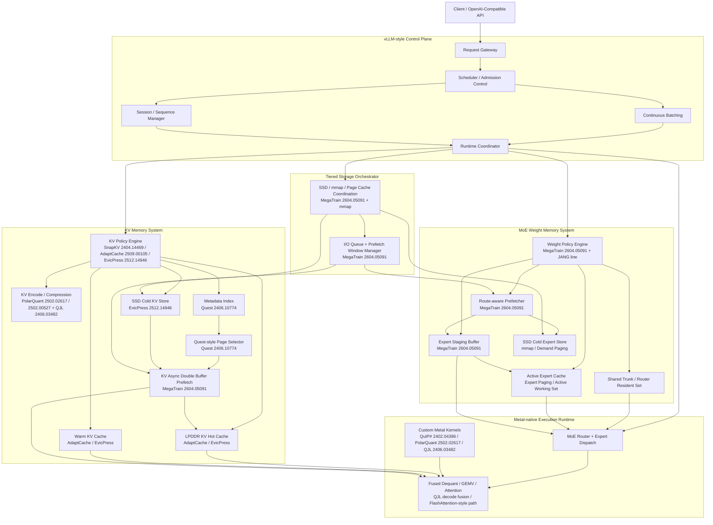
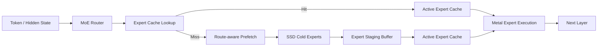
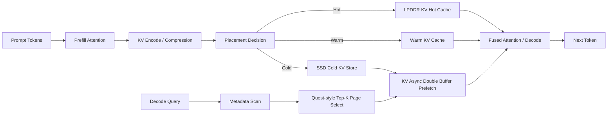

# oMLX Memory-First MoE Serving 系統架構模組圖

## 1. 目標定位

這份新版架構的核心，不再只是「長 context 的 KV 壓縮系統」，而是：

> **在 Apple Silicon 的固定 UMA 預算下，以模型規模優先，聯合優化 MoE 權重與 KV cache，讓超大模型、實用級長 context 與後續多租戶 serving 同時變得可行。**

目前的設計立場如下：

- 平台：Apple Silicon / UMA / Metal / SSD
- serving 骨架：借鑑 `vLLM` / `vllm-metal`
- 執行路徑：`Metal-first runtime`
- 熱點路徑：必要時直接實作或呼叫 `Metal API`
- 第一優先：**模型規模**
- 第二優先：**實用級長 context**
- 第三優先：**多用戶 serving / 吞吐**
- 目標模型：**1.1T class sparse MoE**，如 `Kimi K2.5` / `DeepSeek-V3` 類型

這代表系統主線必須從「只做 KV lifecycle」升級為兩條並列主線：

1. **MoE Weight Memory System**
2. **KV Memory System**

---

## 2. 核心設計原則

### 2.1 Model Scale First

系統的首要任務，是讓更大的 sparse MoE 模型在單機 Apple Silicon 上變得可用，而不是先追小模型 benchmark。

### 2.2 Memory-first，而不是 Framework-first

架構不是為了綁定單一 runtime 而設計，而是為了控制：

- 權重工作集
- active experts
- KV working set
- SSD <-> UMA <-> GPU 的資料流

### 2.3 用算力換空間

可接受額外的：

- 量化 / 解量化
- fused kernel
- route-aware prefetch
- metadata scan
- staging / double buffer

來交換：

- 更大的模型參數量
- 更長的 context
- 更低的記憶體搬運壓力

### 2.4 權重與 KV 聯合優化

如果只優化權重，不優化 KV，context 會失敗。  
如果只優化 KV，不優化權重，超大 MoE 模型放不下。  
因此新版架構必須把兩者視為同一個總體記憶體問題。

---

## 3. 256GB Mac 的工作集假設

這份架構以 `256GB UMA` 的機器為例，保守抓 **約 192GB** 作為可調度的有效工作集。

新版架構不把這 192GB 全部留給單一子系統，而是切成兩個主要工作集與一個保留區：

| 區塊 | 建議範圍 | 角色 |
| --- | --- | --- |
| Active Model Working Set | 72GB - 80GB | 共享權重、router、當前熱專家、目前 layer 所需權重 |
| Expert Staging / Prefetch Buffer | 16GB - 24GB | 專家預取、雙緩衝、layer/expert staging |
| KV Working Set | 80GB - 95GB | 實用級長 context 的 hot/warm KV 工作集 |
| Runtime Headroom | 10GB - 16GB | Metal temporary buffers、scheduler、OS/page cache、碎片與突發峰值 |

這個分帳的含義是：

- **模型規模優先**，所以權重側預算不能太薄
- **context 不能小到失去產品價值**，所以 KV 不能再退回玩具級配置
- `SSD` 不是被動 swap，而是 **cold expert / cold KV 的主動分層**

---

## 4. 總體模組圖

---

## 5. 分層說明

### 5.1 vLLM-style Control Plane

這一層借鑑 `vLLM` 的 serving worldview，而不是自己重造整套 scheduler 語意。

- **Request Gateway**
  - 接收 OpenAI-compatible API 請求
  - 做請求封裝、路由、認證與模型映射
- **Scheduler / Admission Control**
  - 控制請求進場順序
  - 平衡 prefill、decode、prefetch 與 cache 壓力
- **Continuous Batching**
  - 讓 decode 過程可以動態插入新請求
  - 為後續多用戶吞吐保留架構基礎
- **Session / Sequence Manager**
  - 維護 sequence、KV block/page、活躍專家狀態
- **Runtime Coordinator**
  - 統一協調權重系統、KV 系統、Metal runtime 與 storage orchestrator

**參考來源**

- 這一層目前以工程骨架為主，主要借鑑 `vLLM` / `vllm-metal` 的 serving 語意與 runtime 分工。
- 長筆記中對應的重點是 `PagedAttention`、`Continuous Batching` 與 `BlockManager` 這類工程能力，而不是單一論文主導的模組。

### 5.2 MoE Weight Memory System

這是新版架構的第一主線，因為它直接決定系統能否承載更大的 sparse MoE。

- **Weight Policy Engine**
  - 控制 bit allocation、hot/cold placement、layer/expert residency
- **Shared Trunk / Router Resident Set**
  - 常駐共享權重、router、embedding、always-hot 路徑
- **Active Expert Cache**
  - 保存目前最常命中的 experts
  - 是模型規模與 decode 穩定度的核心工作集
- **Expert Staging Buffer**
  - 專門處理 SSD -> UMA -> GPU 的中繼搬運
  - 用來實作雙緩衝與預取遮蔽
- **Route-aware Prefetcher**
  - 根據 router 結果、下一層專家預測、歷史命中率，預先搬運 cold experts
- **SSD Cold Expert Store**
  - 保存非活躍 experts
  - 是支撐 1.1T class MoE 的核心擴充層

**參考來源**

- **MegaTrain: A Memory-Centric System for Foundation Model Training** (`arXiv:2604.05091`)
  - 對應這一層的 `Expert Staging Buffer`、`Route-aware Prefetcher`、雙緩衝管線、動態層綁定、結構化 MoE 分組。
- **Weight Paging / On-demand Weight Loading / mmap**
  - 在長筆記中被明確整理成工程策略：
  - `mmap` / demand paging
  - `Layer-wise Paging`
  - `Expert Paging (MoE)`
  - `QJL-Backed Paging`
- **PolarQuant + QJL**
  - 雖然主要在 KV 路徑中使用，但長筆記也明確提到可把同一套壓縮邏輯延伸到權重分頁與 SSD 權重搬運，作為 `Expert Paging` 的壓縮基礎。

### 5.3 KV Memory System

這是新版架構的第二主線，負責在模型規模成立後，保住實用級長 context。

- **KV Policy Engine**
  - 控制 KV 的 placement、壓縮、eviction、retrieval
- **KV Encode / Compression**
  - 將 KV 轉為適合存放與搬運的表示
- **LPDDR KV Hot Cache**
  - 當前 decode 最常用的 KV pages
- **Warm KV Cache**
  - 短期內可能再命中的中間層
- **SSD Cold KV Store**
  - 保存遠距上下文與非活躍頁面
- **Metadata Index**
  - 保存 page 級摘要
  - 避免 decode 每次掃完整個 KV
- **Quest-style Page Selector**
  - 根據 query 與 metadata 選出真正該回讀的 pages
- **KV Async Double Buffer Prefetch**
  - 從 SSD 非同步拉回壓縮 KV block
  - 與 GPU 計算重疊，隱藏 I/O 延遲

**參考來源**

- **SnapKV** (`arXiv:2404.14469`)
  - 對應 prefill 階段的低價值 token 過濾，屬於 `KV Policy Engine` 的上游減量邏輯。
- **MiniCache** (`arXiv:2405.14366`)
  - 對應 `Layer-wise KV Compression` 的相鄰層融合思路。
- **xKV** (`arXiv:2503.18893`)
  - 對應 `Layer-wise KV Compression` 的跨層 SVD / 低秩共享思路。
- **AdaptCache** (`arXiv:2509.00105`)
  - 對應 KV 的 utility-aware 壓縮與 hot/warm/cold 分層。
- **EvicPress** (`arXiv:2512.14946`)
  - 對應 KV 的 placement / eviction / SSD cold tier。
- **Quest** (`arXiv:2406.10774`)
  - 對應 `Metadata Index` 與 `Quest-style Page Selector`。
- **MegaTrain** (`arXiv:2604.05091`)
  - 對應 `KV Async Double Buffer Prefetch` 的雙緩衝預取思路。

### 5.4 Metal-native Execution Runtime

這一層不是單純依賴高層 framework，而是把 Apple 平台的核心熱點握在自己手上。

- **MoE Router + Expert Dispatch**
  - 把 hidden states 導向正確 experts
  - 對接 active expert cache 與 staging buffer
- **Fused Dequant / GEMV / Attention**
  - 將權重 dequant、KV decode、attention 盡量融合
  - 用算力換頻寬，避免中間張量回寫
- **Custom Metal Kernels**
  - 包含 `FWHT / Hadamard`
  - `PolarQuant + QJL encode/decode`
  - `expert gather/scatter`
  - 其他高頻 data movement / compute 熱點

**參考來源**

- **QuIP#** (`arXiv:2402.04396`)
  - 對應 randomized Hadamard transform / incoherence，在 `FWHT / Hadamard` 這條線上最接近目前要寫的 Metal kernel 參考。
- **PolarQuant** (`arXiv:2502.02617`)
  - 對應 KV cache polar transformation + random preconditioning。
- **PolarQuant** (`arXiv:2502.00527`)
  - 對應 RoPE 成對維度轉 polar coordinates 與 decode acceleration。
- **QJL** (`arXiv:2406.03482`)
  - 對應低 bit KV 表示、QJL encode/decode 與壓縮態存放。
- **FlashAttention-style fusion**
  - 長筆記裡明確提到把 `QJL 解壓` 與 attention 融合在同一條 Metal path 中；這裡先視為工程融合方向，之後可再細化到特定 attention kernel 論文。

### 5.5 Tiered Storage Orchestrator

這一層不是單純讓作業系統自動 swap，而是主動管理分層存放。

- **SSD / mmap / Page Cache Coordination**
  - 控制 cold expert 與 cold KV 的檔案映射方式
- **I/O Queue + Prefetch Window Manager**
  - 管理預取節奏
  - 避免 expert 與 KV 同時爭搶 I/O
  - 為 decode 建立穩定的資料到達窗口

**參考來源**

- **MegaTrain** (`arXiv:2604.05091`)
  - 對應 memory-centric system、主動預取、雙緩衝與 overlap execution。
- **AdaptCache** (`arXiv:2509.00105`)
  - 對應多層級 cache hierarchy 與 utility-aware placement。
- **EvicPress** (`arXiv:2512.14946`)
  - 對應 SSD / LPDDR 之間的 eviction / placement 決策。
- **Quest** (`arXiv:2406.10774`)
  - 對應 page 級 metadata 導引的 sparse 回讀。
- **mmap / demand paging**
  - 對應 Apple Silicon 上的 file-backed mapping 與 page cache 配合。

---

## 6. 關鍵資料流

### 6.1 MoE 權重生命週期

這條路徑反映的核心思想是：

- `MoE` 的可行性，來自於「不是每個 token 都要讀全部參數」
- 因此必須把 **expert residency** 與 **route-aware prefetch** 視為第一級核心模組

### 6.2 KV 生命週期

這條路徑反映的核心思想是：

- context 不是越大越好，而是要在 **可接受的 decode 頻寬成本** 下變大
- 因此 `metadata + sparse retrieval + prefetch` 是長 context 成立的必要條件

---

## 7. 模組責任與參考來源對照表

| 模組 | 主要責任 | 新版優先級 | 主要參考來源 |
| --- | --- | --- | --- |
| Request Gateway | API 接入與請求封裝 | 高 | `vLLM` / `vllm-metal` 工程骨架 |
| Scheduler / Admission Control | 調度 prefill / decode / prefetch | 高 | `vLLM` / `vllm-metal` 工程骨架 |
| Runtime Coordinator | 協調權重、KV、Metal、storage | 高 | 自研整合；runtime 分工參考 `vLLM` / `vllm-metal` |
| Weight Policy Engine | 控制權重 hot/cold、bit allocation | 最高 | `JANG` mixed precision line；MegaTrain (`arXiv:2604.05091`) |
| Shared Trunk / Router Resident Set | 常駐共享權重與 router | 最高 | MoE working set 策略；MegaTrain (`arXiv:2604.05091`) |
| Active Expert Cache | 維持 MoE 活躍工作集 | 最高 | Expert Paging / Active Working Set；MegaTrain (`arXiv:2604.05091`) |
| Expert Staging Buffer | SSD -> UMA -> GPU 中繼與雙緩衝 | 最高 | MegaTrain (`arXiv:2604.05091`) |
| Route-aware Prefetcher | 依 router 預取 experts | 最高 | MegaTrain (`arXiv:2604.05091`)；MoE routing-aware prefetch engineering line |
| SSD Cold Expert Store | 支撐 1.1T class MoE | 最高 | `mmap` / demand paging；Weight Paging / Expert Paging 工程策略 |
| KV Policy Engine | 控制 KV 壓縮、減量、placement | 高 | SnapKV (`arXiv:2404.14469`)；AdaptCache (`arXiv:2509.00105`)；EvicPress (`arXiv:2512.14946`) |
| KV Encode / Compression | 壓縮 KV 以利 LPDDR / SSD 存放 | 高 | PolarQuant (`arXiv:2502.02617`, `arXiv:2502.00527`)；QJL (`arXiv:2406.03482`)；QuIP# (`arXiv:2402.04396`) |
| Layer-wise KV Compression | 壓縮 depth 維度冗餘 | 中高 | MiniCache (`arXiv:2405.14366`)；xKV (`arXiv:2503.18893`)；Cross-layer Fusion line |
| Metadata Index / Page Selector | 減少 KV 掃描量 | 高 | Quest (`arXiv:2406.10774`) |
| KV Async Double Buffer Prefetch | 遮蔽 cold KV I/O 延遲 | 高 | MegaTrain (`arXiv:2604.05091`) |
| Metal-native Execution Runtime | 執行熱路徑與融合 kernel | 最高 | `vllm-metal`；QuIP# (`arXiv:2402.04396`)；PolarQuant (`arXiv:2502.02617`)；QJL (`arXiv:2406.03482`) |
| Tiered Storage Orchestrator | 管理 SSD / UMA / page cache | 最高 | MegaTrain (`arXiv:2604.05091`)；AdaptCache (`arXiv:2509.00105`)；EvicPress (`arXiv:2512.14946`)；Quest (`arXiv:2406.10774`) |

---

## 8. 主要論文索引

| 技術 | 論文 | 編號 |
| --- | --- | --- |
| SnapKV | *SnapKV: LLM Knows What You are Looking for Before Generation* | `arXiv:2404.14469` |
| Quest | *Quest: Query-Aware Sparsity for Efficient Long-Context LLM Inference* | `arXiv:2406.10774` |
| MiniCache | *MiniCache: KV Cache Compression in Depth Dimension for Large Language Models* | `arXiv:2405.14366` |
| xKV | *xKV: Cross-Layer SVD for KV-Cache Compression* | `arXiv:2503.18893` |
| AdaptCache | *AdaptCache: KV Cache Native Storage Hierarchy for Low-Delay and High-Quality Language Model Serving* | `arXiv:2509.00105` |
| EvicPress | *EvicPress: Joint KV-Cache Compression and Eviction for Efficient LLM Serving* | `arXiv:2512.14946` |
| MegaTrain | *MegaTrain: A Memory-Centric System for Foundation Model Training* | `arXiv:2604.05091` |
| QJL | *QJL: 1-Bit Quantized JL Transform for KV Cache Quantization with Zero Overhead* | `arXiv:2406.03482` |
| PolarQuant (KV / random preconditioning line) | *PolarQuant: Quantizing KV Caches with Polar Transformation* | `arXiv:2502.02617` |
| PolarQuant (RoPE / decode acceleration line) | *PolarQuant: Leveraging Polar Transformation for Efficient Key Cache Quantization and Decoding Acceleration* | `arXiv:2502.00527` |
| QuIP# | *QuIP#: Even Better LLM Quantization with Hadamard Incoherence and Lattice Codebooks* | `arXiv:2402.04396` |

補充說明：

- `mmap / demand paging / weight paging / expert paging` 在目前文件中是以**系統工程策略**出現，不一定有單一對應論文。
- `FlashAttention-style fusion` 在目前文件中也是工程路線描述，重點是把 `QJL decode` 與 attention kernel 融合，而不是先綁死單一論文。
- `JANG` 目前在這份 repo 中主要作為**權重量化與 Metal kernel 工程線**參考，而不是用單篇 paper 定義。

---

## 9. 建議的實作優先順序

### Phase 1: 先讓超大 MoE 跑起來

- `vLLM-style control plane`
- `Metal-native runtime` baseline
- `Weight Policy Engine`
- `Active Expert Cache`
- `SSD Cold Expert Store`
- `Route-aware Prefetcher`

### Phase 2: 補上實用級長 context

- `KV Encode / Compression`
- `LPDDR / Warm / SSD` 三層 KV
- `Metadata Index`
- `Quest-style retrieval`
- `KV Async Double Buffer Prefetch`

### Phase 3: 把 decode 做到穩定

- fused dequant / GEMV / attention
- custom Metal kernels
- I/O queue 與 prefetch window 調校
- 權重與 KV 的衝突管理

### Phase 4: 再往多用戶 serving 擴展

- 更成熟的 admission control
- QoS / fairness policy
- 多 session 下的權重與 KV 動態分帳
- 真正的高併發 continuous batching 最佳化

---

## 10. 一句話總結

新版 oMLX 架構可以視為：

> **以 `vLLM` 為 control plane、以 `Metal` 為 execution path、以 `MoE 權重分層` 與 `KV 分層快取` 為雙主線，在固定 UMA 預算下最大化模型規模與實用級長 context 的 Apple Silicon serving 系統。**
